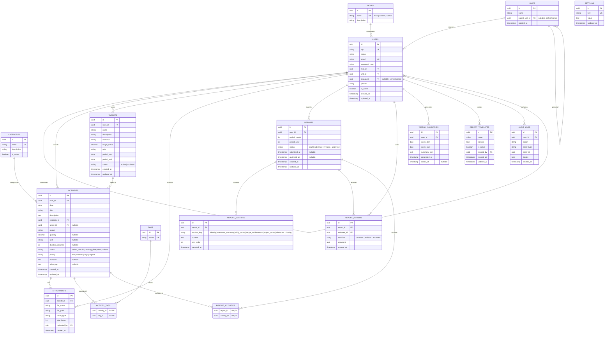

# ERD Database SKPFlow (from PRD_SKPFlow_ASN.md)

```mermaid
erDiagram
    ROLES ||--o{ USERS : "assigned to"
    UNITS ||--o{ USERS : "employs"
    UNITS ||--o{ UNITS : "parent of"
    USERS ||--o{ USERS : "supervises"
    USERS ||--o{ ACTIVITIES : "records"
    CATEGORIES ||--o{ ACTIVITIES : "categorizes"
    USERS ||--o{ TARGETS : "owns"
    TARGETS ||--o{ ACTIVITIES : "linked to"
    ACTIVITIES ||--o{ ATTACHMENTS : "has"
    USERS ||--o{ ATTACHMENTS : "uploads"
    ACTIVITIES ||--o{ ACTIVITY_TAGS : "tagged with"
    TAGS ||--o{ ACTIVITY_TAGS : "labels"
    USERS ||--o{ REPORTS : "submits"
    REPORTS ||--o{ REPORT_SECTIONS : "contains"
    REPORTS ||--o{ REPORT_REVIEWS : "receives"
    USERS ||--o{ REPORT_REVIEWS : "writes"
    REPORTS ||--o{ REPORT_ACTIVITIES : "includes"
    ACTIVITIES ||--o{ REPORT_ACTIVITIES : "included in"
    USERS ||--o{ WEEKLY_SUMMARIES : "generates"
    USERS ||--o{ REPORT_TEMPLATES : "creates"
    USERS ||--o{ AUDIT_LOGS : "performs"

    ROLES {
        uuid id PK
        string name UK "ASN | Atasan | Admin"
        string description
    }

    UNITS {
        uuid id PK
        string name
        uuid parent_unit_id FK "nullable, self-reference"
        timestamp created_at
    }

    USERS {
        uuid id PK
        string nip UK
        string nama
        string email UK
        string password_hash
        uuid role_id FK
        uuid unit_id FK
        uuid atasan_id FK "nullable, self-reference"
        string jabatan
        boolean is_active
        timestamp created_at
        timestamp updated_at
    }

    CATEGORIES {
        uuid id PK
        string name UK
        string description
        boolean is_active
    }

    TARGETS {
        uuid id PK
        uuid user_id FK
        string name
        string description
        string indicator
        decimal target_value
        string unit
        date period_start
        date period_end
        string status "active | archived"
        timestamp created_at
        timestamp updated_at
    }

    ACTIVITIES {
        uuid id PK
        uuid user_id FK
        date date
        string title
        text description
        uuid category_id FK
        uuid target_id FK "nullable"
        string output
        decimal quantity "nullable"
        string unit "nullable"
        int duration_minutes "nullable"
        string status "belum_dimulai | sedang_dikerjakan | selesai"
        string priority "low | medium | high | urgent"
        text obstacle "nullable"
        text follow_up "nullable"
        timestamp created_at
        timestamp updated_at
    }

    ATTACHMENTS {
        uuid id PK
        uuid activity_id FK
        string file_name
        string file_path
        string mime_type
        int size_bytes
        uuid uploaded_by FK
        timestamp created_at
    }

    TAGS {
        uuid id PK
        string name UK
    }

    ACTIVITY_TAGS {
        uuid activity_id PK, FK
        uuid tag_id PK, FK
    }

    REPORTS {
        uuid id PK
        uuid user_id FK
        int period_month
        int period_year
        string status "draft | submitted | revision | approved"
        timestamp submitted_at "nullable"
        timestamp reviewed_at "nullable"
        timestamp created_at
        timestamp updated_at
    }

    REPORT_SECTIONS {
        uuid id PK
        uuid report_id FK
        string section_key "identity | executive_summary | daily_recap | target_achievement | output_recap | obstacles | closing"
        text content
        int sort_order
        timestamp updated_at
    }

    REPORT_REVIEWS {
        uuid id PK
        uuid report_id FK
        uuid reviewer_id FK
        string decision "comment | revision | approved"
        text comment
        timestamp created_at
    }

    REPORT_ACTIVITIES {
        uuid report_id PK, FK
        uuid activity_id PK, FK
    }

    WEEKLY_SUMMARIES {
        uuid id PK
        uuid user_id FK
        date week_start
        date week_end
        text summary_text
        timestamp generated_at
        timestamp edited_at "nullable"
    }

    REPORT_TEMPLATES {
        uuid id PK
        string name
        text content
        boolean is_active
        uuid created_by FK
        timestamp created_at
        timestamp updated_at
    }

    AUDIT_LOGS {
        uuid id PK
        uuid user_id FK
        string action
        string entity_type
        uuid entity_id
        json details
        timestamp created_at
    }

    SETTINGS {
        uuid id PK
        string key UK
        text value
        timestamp updated_at
    }
```